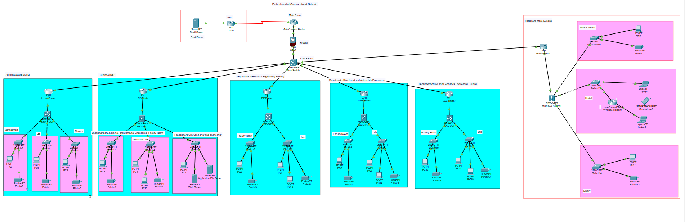
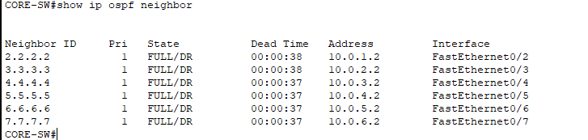
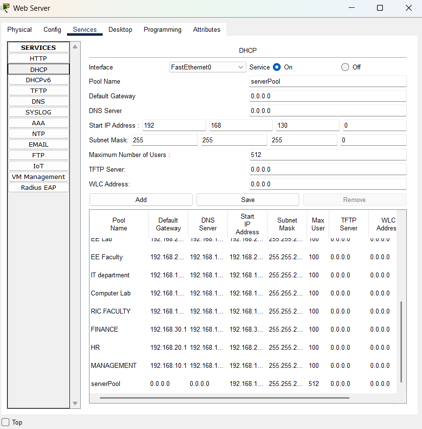
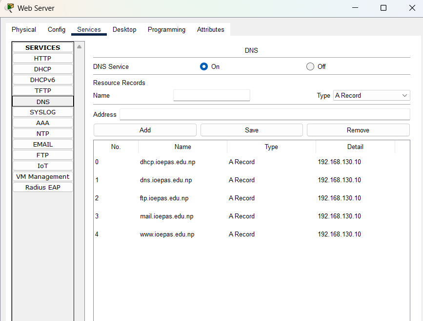
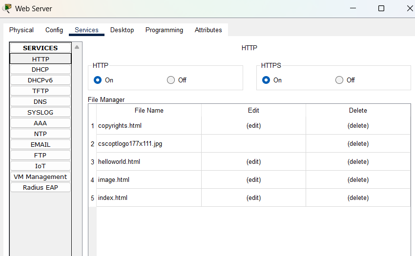
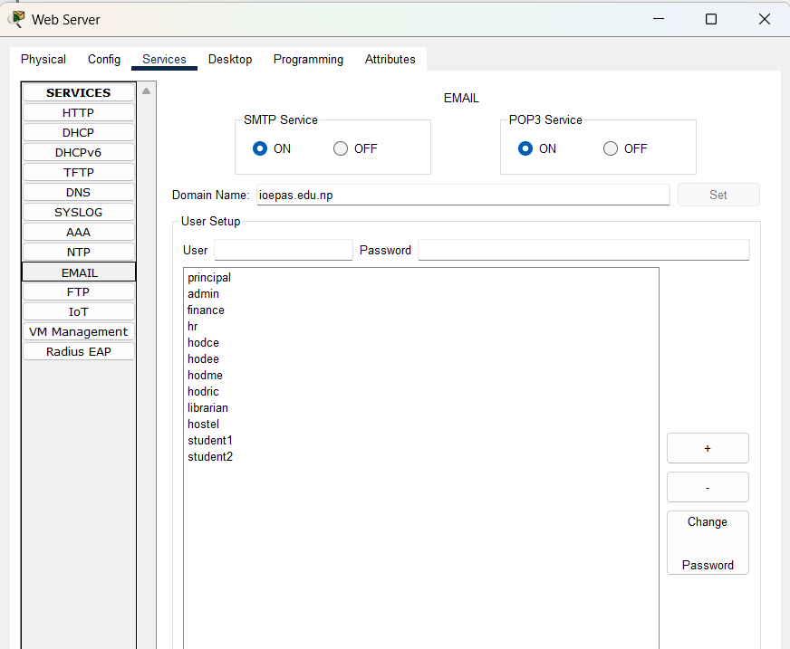
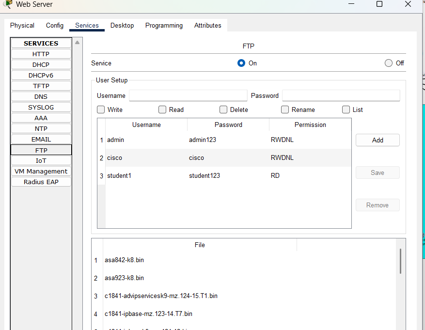
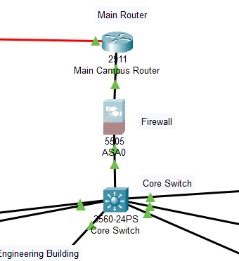
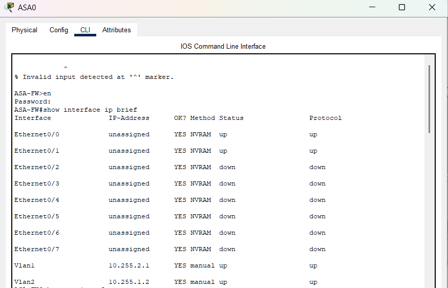
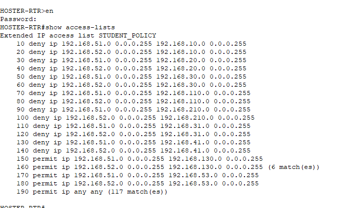

# 🎓 IOE Paschimanchal Campus Network Design & Implementation

A secure, scalable, and enterprise-style Campus Area Network (CAN) designed and implemented using **Cisco Packet Tracer** for **IOE Paschimanchal Campus, Pokhara, Nepal**.

This project demonstrates the design and implementation of a modern campus network following the **Cisco Hierarchical Network Model**, integrating routing, VLAN segmentation, centralized network services, firewall security, and access control.

---

## 📌 Project Overview

The objective of this project is to design a reliable and secure campus network that connects multiple academic and administrative buildings while providing centralized services such as:

- Dynamic Routing (OSPF)
- VLAN Segmentation
- Inter-VLAN Routing
- DHCP
- DNS
- HTTP (Web Server)
- FTP Server
- Email Server (SMTP & POP3)
- Cisco ASA Firewall
- ACL-based Network Security
- Device Hardening

---

# 🏛 Campus Buildings

The network consists of the following buildings:

- Administrative Building
- RIC (Research & Innovation Center)
- Electrical Engineering Building
- Mechanical Engineering Building
- Civil Engineering Building
- Hostel Building
- Library
- Mess
- Server Room

---

# 🏗 Network Architecture

The project follows the **Cisco Three-Tier Hierarchical Architecture**.

```
                     Internet
                         │
                      Cloud
                         │
                 Main Campus Router
                         │
                    Cisco ASA Firewall
                         │
                     Core L3 Switch
                         │
 ──────────────────────────────────────────────────────
 │        │        │        │        │        │
Admin    RIC      EE       ME      Civil   Hostel
Router   Router   Router   Router  Router   Router
 │        │        │        │        │        │
L3 SW    L3 SW    L3 SW    L3 SW   L3 SW    L3 SW
 │        │        │        │        │        │
Access   Access   Access   Access  Access   Access
Switches Switches Switches Switches Switches Switches
 │
End Devices
```

---

# 📂 Network Components

## Core Layer

- Main Campus Router
- Cisco ASA Firewall
- Core Layer 3 Switch

---

## Distribution Layer

- Administrative Distribution Switch
- RIC Distribution Switch
- EE Distribution Switch
- ME Distribution Switch
- Civil Distribution Switch
- Hostel Distribution Switch

---

## Access Layer

- Department Switches
- Faculty Switches
- Laboratory Switches
- Library Switch
- Hostel Switch
- Mess Switch

---

# 🌐 IP Addressing Scheme

## Router Links

| Link | Network |
|------|---------|
| Core ↔ Admin | 10.0.1.0/30 |
| Core ↔ RIC | 10.0.2.0/30 |
| Core ↔ EE | 10.0.3.0/30 |
| Core ↔ ME | 10.0.4.0/30 |
| Core ↔ Civil | 10.0.5.0/30 |
| Core ↔ Hostel | 10.0.6.0/30 |

---

# 🖧 VLAN Design

| VLAN | Department | Network |
|------|------------|---------|
| 10 | Management | 192.168.10.0/24 |
| 20 | HR | 192.168.20.0/24 |
| 30 | Finance | 192.168.30.0/24 |
| 110 | RIC Faculty | 192.168.110.0/24 |
| 120 | RIC Laboratory | 192.168.120.0/24 |
| 130 | IT & Server Room | 192.168.130.0/24 |
| 210 | EE Faculty | 192.168.210.0/24 |
| 220 | EE Laboratory | 192.168.220.0/24 |
| 31 | ME Faculty | 192.168.31.0/24 |
| 32 | ME Laboratory | 192.168.32.0/24 |
| 41 | Civil Faculty | 192.168.41.0/24 |
| 42 | Civil Laboratory | 192.168.42.0/24 |
| 51 | Hostel | 192.168.51.0/24 |
| 52 | Mess | 192.168.52.0/24 |
| 53 | Library | 192.168.53.0/24 |

---

# 🔀 Routing

Dynamic routing is implemented using **OSPF Area 0**.

### Advantages

- Dynamic Route Learning
- Fast Convergence
- Scalable
- Supports Future Expansion
- Enterprise Standard

---

# 🌍 Network Services

## DHCP

- Automatic IP Address Assignment
- Gateway Assignment
- DNS Assignment

---

## DNS

Domain:

```
ioepas.edu.np
```

Configured DNS Records

```
www.ioepas.edu.np

mail.ioepas.edu.np

ftp.ioepas.edu.np
```

---

## HTTP

Provides the campus website.

```
http://www.ioepas.edu.np
```

---

## FTP

Centralized file storage and sharing.

---

## Email

Protocols Used

- SMTP
- POP3

Example Users

```
student1@ioepas.edu.np

teacher1@ioepas.edu.np

admin@ioepas.edu.np
```

---

# 🔒 Security Features

Implemented security includes:

- Cisco ASA Firewall
- VLAN Segmentation
- Access Control Lists (ACLs)
- SSH Remote Management
- Enable Secret
- Password Encryption
- Local User Authentication
- Console Security
- VTY Security
- MOTD Banner

---

# 🔥 Firewall

Cisco ASA Firewall provides

- Inside/Outside Interfaces
- NAT
- Internet Connectivity
- Traffic Filtering

---

# 🛡 ACL Policy

### Students are Restricted From

- Management Department
- HR Department
- Finance Department

### Students are Allowed To Access

- DNS Server
- Web Server
- FTP Server
- Email Server
- Library
- Internet

---

# 🧪 Testing & Verification

The following functionalities were successfully tested.

| Test | Status |
|------|--------|
| VLAN Communication | ✅ |
| Inter-VLAN Routing | ✅ |
| OSPF Routing | ✅ |
| DHCP | ✅ |
| DNS | ✅ |
| HTTP | ✅ |
| FTP | ✅ |
| Email | ✅ |
| ASA Firewall | ✅ |
| ACL Policy | ✅ |

---

# 📸 Screenshots

Add screenshots in the following directory:

```
Images/
```
     
### Topology.png


### OSPF.png


### DHCP.png


### DNS.png
  

### HTTP.png


### EMAIL.png


### FTP.png


### Firewall.png and Firewall-config.png

 

### ACLs.png

---

# 📁 Repository Structure

```
Campus-Enterprise-Network-Design/
│
├── README.md
├── Pashchimanchal_Campus_Internal_Network_Project.pkt
│
├── Images/
│   ├── Topology.png
│   ├── DHCP.png
│   ├── DNS.png
│   ├── HTTP.png
│   ├── FTP.png
│   ├── Email.png
│   ├── Firewall.png
│   └── ACL.png
│
└── LICENSE
```

---

# 🚀 Future Improvements

- Port Security
- BPDU Guard
- PortFast
- EtherChannel
- HSRP
- VRRP
- SNMP Monitoring
- Syslog Server
- NTP Server
- IPv6
- IDS/IPS
- VPN Remote Access

---

# 🎯 Learning Outcomes

Through this project, the following networking concepts were implemented and verified:

- Enterprise Network Design
- Hierarchical Network Architecture
- VLAN Configuration
- Inter-VLAN Routing
- Dynamic Routing (OSPF)
- DHCP Configuration
- DNS Configuration
- Web Server Deployment
- FTP Server Deployment
- Email Server Configuration
- Cisco ASA Firewall Configuration
- ACL Implementation
- Network Security
- Network Troubleshooting
- Device Hardening

---

# 🛠 Technologies Used

- Cisco Packet Tracer
- Cisco IOS
- Cisco ASA Firewall
- OSPF
- VLANs
- DHCP
- DNS
- HTTP
- FTP
- SMTP
- POP3
- ACLs

---

# 👨‍💻 Author

**Chandra Kamal Singh**

Bachelor of Electronics, Communication and Information Engineering

Institute of Engineering (IOE)

Paschimanchal Campus

Pokhara, Nepal

---

# 📜 License

This project is developed for educational purposes as part of an undergraduate engineering project.

Feel free to use and modify it for learning purposes.